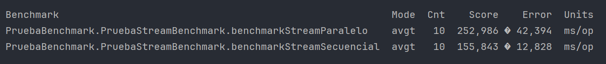

## Reporte de cobertura de Tests:

Mediante el uso de la herramienta Jacoco se obtuvo el reporte sobre la cobertura de Test, en este reporte se puede
observar que todas las clases salvo "Main", la cual no contiene métodos para testear, están cubiertas en un 100% por los
tests realizados.

## Prueba de Benchmark:

Las pruebas de Benchmark fueron ejecutadas en modo “average time” (avgt), el cual mide el tiempo promedio que toma una
operación en milisegundos (ms/op). En este caso, la ejecución secuencial ("benchmarkStreamSecuencial") obtuvo un
menor "Score" (155,843 ms/op) en comparación con la ejecución paralela ("benchmarkStreamParalelo") que obtuvo un "
Score" de 252,986 ms/op. Esto indica que para esta tarea específica, el uso de streams secuenciales es más eficiente
en términos de tiempo promedio de operación. La tasa de error es baja en ambas pruebas, lo que sugiere que los
resultados son confiables y consistentes.

# Correcciones - Estado: APROBADO

## Adicionales:

- En la elaboración de sus conclusiones, es fundamental que incluyan los valores obtenidos en la descripción y
  cuantifiquen los resultados con medidas específicas. Al hacer esto, sus conclusiones serán más precisas y sólidas.
  Para futuros trabajos, les sugiero actualizar directamente el archivo `README.md` con estas conclusiones y las nuevas
  imágenes pertinentes, en lugar de incluirlas únicamente en la sección de "Correcciones realizadas".

  En relación a los resultados, la conclusión que han presentado es correcta; sin embargo, me gustaría destacar un
  aspecto crucial. Es importante que comprendan que, a pesar de las variaciones posibles debido al hardware utilizado,
  (como podemos observar en su caso particular) la diferencia principal radica en cómo se utilizan los núcleos de la CPU
  en los diferentes enfoques.

  En un enfoque secuencial, se emplea un único núcleo de la CPU, por lo que el tiempo de ejecución se basa únicamente en
  el rendimiento de ese núcleo para completar todas las operaciones. En contraste, el **Stream Paralelo** debería
  resultar considerablemente más rápido que el **Stream Secuencial** en términos de tiempo de ejecución (en éste caso
  medido en milisegundos por operación, ms/op).

  Suponiendo que contamos con 2 núcleos, el rendimiento paralelo idealmente debería acercarse a la mitad del tiempo
  requerido por el método secuencial, siempre y cuando el procesamiento se distribuya de manera óptima y no existan
  otros cuellos de botella. No obstante, en la práctica, esta mejora ideal rara vez se alcanza.

  Además, es posible observar que el margen de error en el **Método Paralelo** puede ser menor si el paralelismo se
  gestiona de manera eficiente y los hilos se distribuyen adecuadamente entre los núcleos. Sin embargo, si la gestión
  del paralelismo es inadecuada, debido a la sincronización y la administración de hilos, el margen de error podría ser
  incluso mayor que en el **Método Secuencial**.

  Otro aspecto importante a considerar, es que en el enfoque paralelo el orden de ejecución no está bajo nuestro control
  y puede darnos resultados impredecibles y desordenados y, como cualquier otra programación paralela, son complejos y
  propensos a errores. Pueden consultar éstos enlaces si desean investigar más: [1], [2].

  Aunque éstas observaciones son complementarias y su trabajo está muy bien, espero que estas observaciones les
  sean útiles para futuros trabajos y la correcta interpretación de los resultados.
- Más allá de haber actualizado el archivo `.gitignore`, el código aún permanece en el repositorio remoto. Quiero
  enfatizar que **IGNORAR UN ARCHIVO YA PUSHEADO NO LO ELIMINA DEL REPOSITORIO**.
  Pueden consultar los siguientes
  artículos para más información: [3], [4], [5]. Tal como mencioné en clase, esto les servirá para entender mejor cómo
  funciona Git.
- En ésta misma línea, les sugiero que sigan buenas prácticas al realizar commits, tales como utilizar verbos en
  imperativo y emplear prefijos para aportar claridad semántica. Les recomiendo leer éste artículo sobre un
  desarrollador español que aborda estos aspectos y otros puntos relevantes. [6]
- Además, he notado que los archivos no han sido formateados adecuadamente y no se ha respetado el número máximo de
  caracteres por línea (la línea gris vertical que tienen en Intellij marca justamente ésto). Un ejemplo es en el
  archivo `README.md`, donde las líneas largas dificultan la lectura al exceder los límites visibles de la pantalla. En
  IntelliJ, pueden formatear el código utilizando el atajo de teclado Ctrl + Alt + L [7]. Con otros shortcuts pueden
  optimizar los imports, y muchas cosas más, aunque esto puede variar según el caso si han cambiado la configuración por
  default.

### Bibliografía:

- \[1]: https://www.geeksforgeeks.org/parallel-vs-sequential-stream-in-java/
- \[2]: https://medium.com/@jadhavsid1101/java-parallel-streams-when-to-use-them-and-when-not-to-211d92ac9e38
- \[3]: https://gitready.com/beginner/2009/03/06/ignoring-doesnt-remove-a-file.html
- \[4]: https://medium.com/@rspesc31/forgot-to-add-node-modules-to-gitignore-solved-6c5b7a444c65
- \[5]: https://stackoverflow.com/questions/19663093/apply-gitignore-on-an-existing-repository-already-tracking-large-number-of-file
- \[6]: https://midu.dev/buenas-practicas-escribir-commits-git/
- \[7]: https://www.jetbrains.com/guide/java/tutorials/reading-code/formatting/#:~:text=If%20we%20encounter%20code%20that,L%20(Windows%2FLinux).
