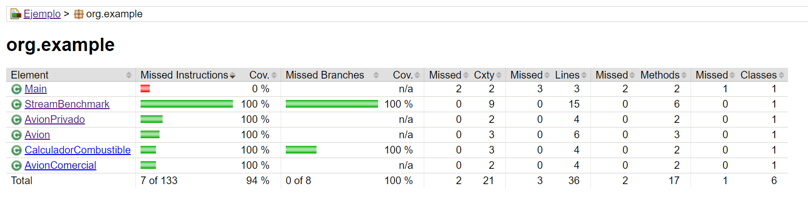
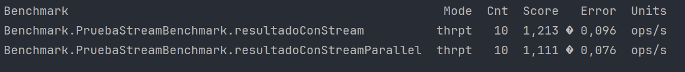

##Reporte de cobertura de Tests;

Mediante el uso de la herramienta Jacoco se obtuvo el reporte sobre la cobertura de Test, en este reporte se puede observar que todas las clases salvo "Main", la cual no contiene métodos para testear, están cubiertas en un 100% por los tests realizados. 
##Prueba de Benchmark:

Las pruebas de Benchmark fueron ejecutadas en modo “throughput” el cual representa la cantidad de operaciones por segundo (ops/s) que puede realizar un programa, siendo la ejecución con "Stream" quien obtuvo un mayor "Score", lo que indica que utilizar este método para esta tarea sería una opción más eficiente que "StreamParallel". Ambos presentaron una tasa de error mínima, por lo que se podría considerar que los resultados son confiables. 

